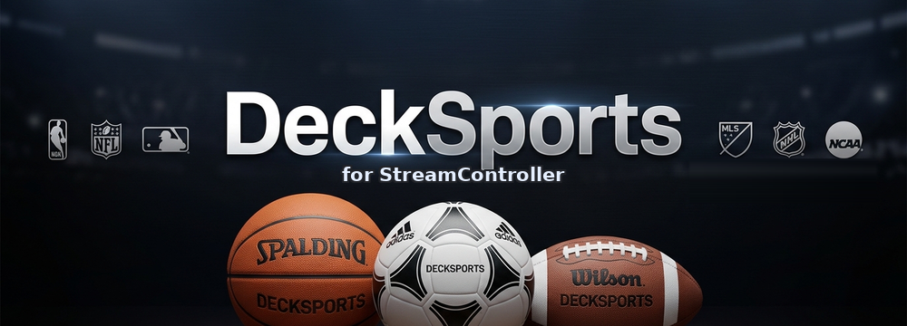
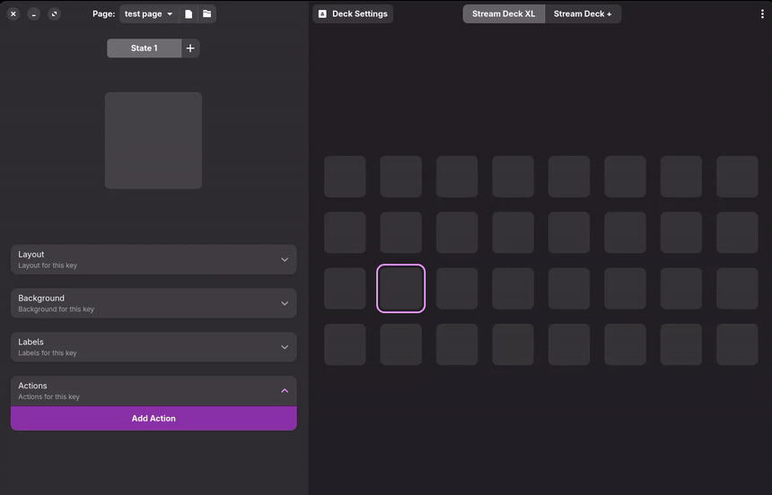
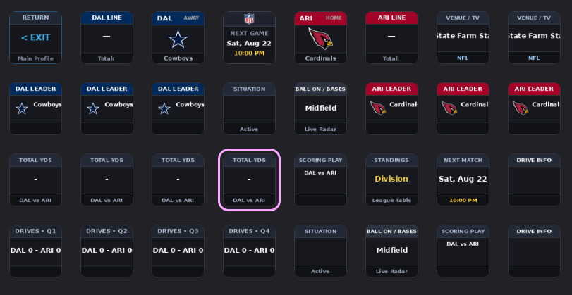
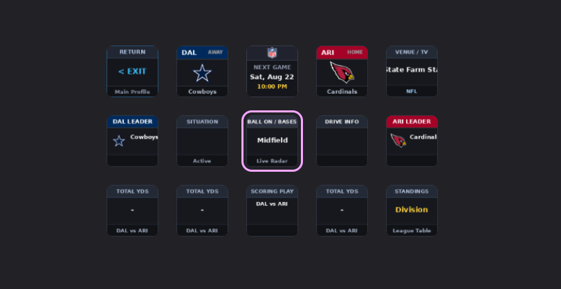

<p align="center">
  
</p>

# DeckSports for StreamController

DeckSports is a sports scoreboard and live game tracking plugin for [StreamController](https://github.com/StreamController/StreamController). It brings real-time scores, game clocks, player leader headshots, situational radars, head-to-head stat comparisons, and drive summaries directly to your Stream Deck keypad without requiring extra browser windows or second monitors.

This plugin was created in collaboration with [Mattdubs9699](https://github.com/Mattdubs9699). Special thanks for contributing to the architecture, visual design concepts, and sports API workflow integrations.

---

## Key Features

* **Modular 3-Button Scoreboard**: Combines three adjacent keys into a single horizontal scoreboard (Visiting Team | Master Game Clock | Host Team).
* **Full-Screen Interactive Game Hub**: One-tap access to an in-depth game dashboard displaying live player leaders, situational radar, quarter-by-quarter line scores, and head-to-head stats.
* **Hardware-Aware Auto-Provisioning**: Detects connected Stream Deck models (Stream Deck XL with 32 keys or Stream Deck MK.2 with 15 keys) and provisions pre-configured dashboard pages automatically.
* **Dynamic Match Synchronization**: Tapping any team's Game Hub key dynamically binds all dashboard tiles to that exact matchup in real time.
* **Player Leader Cards**: Displays athlete headshots, names, jersey numbers, and live in-game metrics for major statistical categories.
* **Situational Radar**: Real-time Down and Distance, Ball Spot, Red Zone alerts, Count and Outs, Occupied Bases diamonds, and Hockey Power Play timers.
* **Head-to-Head Comparison**: Compare Total Yards, 3rd Down Efficiency, Turnovers, Fouls, Time of Possession, Standings, and Next Match schedules.
* **Optimized Performance**: In-memory font caching and non-blocking asynchronous rendering deliver instant page transitions.

---

## 3-Button Scoreboard

DeckSports is designed to link three keys across any row on your keypad:

<p align="center">
  
</p>

* **Left Key (Visiting Team)**: Displays team branding, primary colors, live score, and record.
* **Center Key (Master Clock)**: Displays the league logo, game period, remaining clock, and possession arrow. Tapping this key opens the full-screen Game Hub dashboard.
* **Right Key (Host Team)**: Displays team branding, primary colors, live score, and record.

### Key Capabilities
* **Automatic Row Pairing**: Place the Game Hub action in the middle and Team Score actions to the left and right. The side keys automatically pair with the center hub on the same row.
* **Multiple Game Rows**: Track multiple matches from different leagues across different rows on the same profile.
* **Standalone 1-Button Mode**: When used on a single key, the Game Hub packs the matchup summary, team logos, and live score into one button.
* **Final Game Status**: When a game concludes, the center button shows a Final badge while preserving the final scores on the side keys.

---

## Full-Screen Game Hub Dashboards

Tapping the center Game Hub key opens a dedicated dashboard page pre-configured for your deck hardware.

### Stream Deck XL Dashboard (32 Keys)

<p align="center">
  
</p>

* **Row 1**: Exit Button, Away Line Score, Away Score/Logo, Centered Game Clock, Home Score/Logo, Home Line Score, Venue Information, Broadcast Details.
* **Row 2**: Away Category Leaders (Passing, Rushing, Receiving), Down and Distance, Ball Spot / Red Zone, Home Category Leaders.
* **Row 3**: Total Yards Comparison, 3rd Down Efficiency, Turnovers, Time of Possession, Last Scoring Play, Division Standings, Next Match Schedule, Live Drive Radar.
* **Row 4**: Quarter 1–4 Line Scores, Contextual Radar, Red Zone Tracker, Scoring Drives Summary, Match Overview.

---

### Stream Deck MK.2 Dashboard (15 Keys)

<p align="center">
  
</p>

* **Row 1**: Exit Button, Away Score/Logo, Centered Game Clock, Home Score/Logo, Venue / TV Information.
* **Row 2**: Away Primary Leader, Down and Distance, Ball Spot / Red Zone, Drive Information, Home Primary Leader.
* **Row 3**: Total Yards Comparison, 3rd Down Efficiency, Last Scoring Play, Turnovers, Division Standings.

---

## Supported Leagues

DeckSports features a sport-adaptive engine supporting 8 major leagues:

| League | Sport | Live Metrics Tracked |
| :--- | :--- | :--- |
| **NFL** | Football | Scores, Clock, Quarters, Possession, Down & Distance, Red Zone, Category Leaders, Total Yards, Turnovers |
| **NBA** | Basketball | Scores, Clock, Quarters/Halves, Bonus/Penalty, Points/Rebounds/Assists Leaders, Field Goal %, 3-Point % |
| **MLB** | Baseball | Scores, Innings, Count, Outs, Base Runners Diamond, Pitching/Batting Stats, Hits, Errors |
| **NHL** | Hockey | Scores, Clock, Periods, Power Play Timer, Empty Net, Goals/Assists/Saves Leaders, Shots on Goal |
| **MLS** | Soccer | Scores, Match Minutes, Halves, Stoppage Time, Cards, Goals/Assists, Possession %, Shots on Target |
| **UFL** | Football | Scores, Clock, Quarters, Possession Arrow, Down & Distance, Red Zone Alerts |
| **NCAA** | College Football & Basketball | Division I & Top 25 live scoreboards, tournament rankings, game clocks |
| **WNBA** | Basketball | Scores, Clock, Quarters, Category Leaders, Team Shooting % |

---

## Installation & Setup

1. **Install Plugin**: Clone or download the repository into your StreamController plugins directory:
   ```bash
   git clone https://github.com/oparada1988/DeckSports.git ~/.var/app/com.core447.StreamController/data/plugins/com_oparada1988_DeckSports
   ```
2. **Setup the 3-Button Scoreboard**:
   * Add a **Game Hub / Clock** action to any key.
   * In the settings sidebar, select your **League** and **Followed Team**.
   * Add **Team Score / Logo** actions to the keys directly to the left and right. They will pair automatically.
3. **Open the Game Hub Dashboard**:
   * Tap the center **Game Hub** key at any time to open the full-screen interactive dashboard.
   * Tap the **`< EXIT`** button on the top-left key to return to your main profile.

---

## Credits & Collaboration

* **Oscar Parada** ([@oparada1988](https://github.com/oparada1988)) — Lead Developer
* **Matt** ([@Mattdubs9699](https://github.com/Mattdubs9699)) — Co-Creator, Feature Architecture & Sports API Collaboration
* Built for the **[StreamController](https://github.com/StreamController/StreamController)** application by Core447.

---

## License

Distributed under the MIT License. See [LICENSE](LICENSE) for more information.
